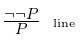
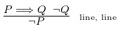
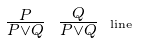
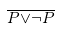

# Xcuuuse
Proof checker

how to build: `ghc --make -shared -fPIC Xcuuuse.hs -o xcuuus.so`

## List of rules

List of rules supported by Xcuuuse. The number and types (single line or range of box) are listed. The order of references does not matter, as long as they are of the correct type.

**Conjuntion introduction**  
  
**Conjunction elimination**  
  
**Double negation introduction**  
  
**Double negation elimination**  
  
**Implication introduction**  
  
**Implication elimination (modus ponens)**  
  
**Equiavlence introduction**  
**Equiavlence elimination**  
**Modus tollens**  
  
**Disjunction introduction**  
  
**Disjunction elimination**  
  
**Reiterate**  
  
**Contradiction elimination**  
  
**Negation introduction**  
  
**Negation elimination**  
  
**Proof by contradiction (reductio ad absurdum)**  
  
**Law of excluded middle (tertium non datur)**  
  


## Grammar
The grammar specification of a `.proof` file, using EBNF notation. The terminals are enclosed within `""`. Square brackets denote the scope of an operator (`*`, `+` or `?`).

```
Proof         ::= [Premise]* Conclusion [Derivation]+
Premise       ::= Natural Formula "p"
Conclusion    ::= Thensym Formula
Derivation    ::= Natural Scope Formula Justification
Scope         ::= ["|"]* ["|*"]?
Justificatoion::= Consym "i" Reference Reference
                  | Consym "e" Reference
                  | Negsym Negsym "i" Reference
                  | Negsym Negsym "e" Reference
                  | Impsym "i" Reference
                  | Impsym "e" Reference Reference
                  | Eqsym "i" Reference Refrence
                  | Eqsym "e" Reference
                  | MTsym Reference Reference
                  | Dissym "i" Reference
                  | Dissym "e" Reference Reference Reference
                  | Resym Reference
                  | Contsym "e" Reference
                  | Negsym "i" Reference
                  | Negsym "e" Reference Reference
                  | Pbcsym Reference
                  | Lemsym
                  | Asssym
Reference     ::= Natural | Range | Natural , Reference | Range , Reference

Formula       ::= Variable | ( Formula ) | Negation | Conjunction | Disjunction 
              | Implication | Equivalence | Contradiction  
Variable      ::= Uppercase | Variable Num | Variable
Negation      ::= Negsym Formula
Conjunction   ::= Formula Consym Formula
Disjunction   ::= Formula Dissym Formula
Implication   ::= Formula Impsym Formula
Equivalence   ::= Formula Eqsym Formula
Contradiction ::= Contsym

Num       ::= "0"|...|"9"  
Natural   ::= "1"|...|"9" | Natural Num
Range     ::= Natural - Natural
Uppercase ::= "A"|...|"Z"
Negsym    ::= "-" | "~"
Consym    ::= "&" | "/\"
Dissym    ::= "v" | "\/"
Impsym    ::= "->" | "=>"  
MTsym     ::= "mt"
Resym     ::= "r"
Contsym   ::= "#"
Pbcsym    ::= "pbc"
Lemsym    ::= "lem"
Eqsym     ::= "=" | "<=>"
Thensym   ::= "|-" 
Asssym    ::= "ass"
```
