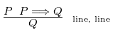
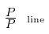

# Xcuuuse
Xcuuuse is a proof checker for natural deduction (currently supporting propositional logic). Given a `.proof` file (specifications below), it is able to assess whether the line reasoning is correct.

## Informal description
The program is provided with a file containing a (partial) proof, and evaluates whether the lines are correctly derived (proof rules has been applied correctly). 

### Propositional formulas
The basic unit of a propositional formula is the atomic proposition. Such a proposition is denoted with a capital letter, followed by a sequence of zero or more digit or apostrophe. So `P` is a valid formula, and so is `P2`, `P'` but also `P32''32'''4'`. More complicated formulas can be built up of these, by combining them using conjunction, disjunction, negation, implication and equivalence. There are several symbols for each of these operations:  
* Negation: `~` `-`
* Conjunction: `&` `/\`
* Disjunction: `v` `\/`
* Implication: `=>` `->`
* Equivalence: `=` `<=>`  

`P&Q` is an example of a more complex formula. When a statement contains of more than one operators, it is parsed according to the standard priorities: Negation binds stronger then conjunction, that is stronger than disjunction, that is stronger than implication, that is stronger than eqivalence. Implication and equivalence associate to the right, the rest associates to the left. Parentheses can be used to give some parts a higher priority. Example of such a formula: `(P&(QvR) => T) => W`.

### Global structure of a proof
The proof starts with stating the premises and the supposed conclusion. Note that a proof does not necessarily have to have premises, but it must have exactly one conclusion. A line is generally built up of 3 distinct parts: a line number (numbering must start with 1 on the top of the file, and getting incremented by 1 every new line), a propositional formula, and a justification of that formula. `Number   Formula  Justification`. The file starts with a premise (if there is any), and, because we don't need to derive those, we just put `p` for justification. After that comes the conclusion. This is a somewhat special line, as it does not require any line number and justification, but it starts with a special symbol `|-` and is followed by a formula. An example of stating the assumption and the conclusion:
```
1   P&(QvR)		p
|- (P&Q)v(P&R)
... proof ...
```
Now each following line is a derivation, that is obtained by applying one of the rules. These lines also start with a number, followed by a scope description, a formula, and a justification.

### Scope
The way of denoting boxes is to put a `|` in the scope part of the line. When a line is in a box that is in another box, it starts with `||`.The first line of each box gets an extra `*`. (It is needed to handle situations where a box is closed, but another one is immediately opened). 
```
1     ...
2 |*  ...
3 ||* ...
4 ||  ...
5 ||* ...
6 ||  ...
7 |   ...
8     ...
```
Here a box is opened at line 2, that contains two other boxes: 3-4 and 5-6. Line 1 and 8 are not part of any box.  

### Justifications
A justification contains of a rule and a number of references to other lines. How many references are needed depends on the exact rule.  
**Note:** providing a justification with an incorrect number of references results into a parser error, that, unlike the other types of errors, does not specify line number. The correct number of references needed for each rule can be found in the grammar.  
In general, the name of the rule is (any) of its symbol, followed by either an `i` for introduction rules, or an `e` for elimination rules. So `&i` is the conjunction introduction. There are exceptions, some rules have a name instead, like `ass` for assumption, `mt` for modus tollens, `pbc` for proof by contradiction, etc. These can all be on the list of rules below (or specified in the grammar).
The proof is correct if the formula of the last line is equivalent to the previously specified conclusion. As an example, here is a proof of disjunction distributivity over conjunctions.
```
1 P & (QvR)		p
|- (P & Q)v(P & R)

2 QvR			&e 1
3 P			&e 1
4 |* Q			ass
5 |  P & Q		&i 3, 4
6 |  (P & Q)v(P & R)	vi 5

7 |* R			ass
8 |  P & R		&i 3, 7
9 |  (P & Q)v(P & R)	vi 8
10 (P & Q)v(P & R)	ve 2, 4-6, 7-9
```
More examples can be found in the `/examples` folder. There is a list of all proof rules below, as well as the grammar specifications, containing all the rules, their names, number and types of expected references.

### Remarks
* The first line of a box needs to be an assumption. Conversely, assumptions can only occur at the first line of boxes.
* The order in which the references are provided does not matter, as long as they are in the right numbers.
* "Symmetrical" formulas are treated as equal if after reordering they are equal. So `P&Q == Q&P` is True, and so is `PvQ == QvP`.

## Grammar
The grammar specification of a `.proof` file, using EBNF notation. The terminals are enclosed within `""`. Square brackets denote the scope of an operator (`*`, `+` or `?`).

```
Proof         ::= [Premise]* Conclusion [Derivation]+
Premise       ::= Natural Formula "p"
Conclusion    ::= Thensym Formula
Derivation    ::= Natural Scope Formula Justification
Scope         ::= ["|"]* ["|*"]?
Justificatoion::= Consym "i" Reference Reference
                  | Consym "e" Reference
                  | Negsym Negsym "i" Reference
                  | Negsym Negsym "e" Reference
                  | Impsym "i" Reference
                  | Impsym "e" Reference Reference
                  | Eqsym "i" Reference Refrence
                  | Eqsym "e" Reference
                  | MTsym Reference Reference
                  | Dissym "i" Reference
                  | Dissym "e" Reference Reference Reference
                  | Resym Reference
                  | Contsym "e" Reference
                  | Negsym "i" Reference
                  | Negsym "e" Reference Reference
                  | Pbcsym Reference
                  | Lemsym
                  | Asssym
Reference     ::= Natural | Range | Natural "," Reference | Range "," Reference

Formula       ::= Variable | "(" Formula ")" | Negation | Conjunction | Disjunction 
              | Implication | Equivalence | Contradiction  
Variable      ::= Uppercase | Variable Num | Variable
Negation      ::= Negsym Formula
Conjunction   ::= Formula Consym Formula
Disjunction   ::= Formula Dissym Formula
Implication   ::= Formula Impsym Formula
Equivalence   ::= Formula Eqsym Formula
Contradiction ::= Contsym

Num       ::= "0"|...|"9"  
Natural   ::= "1"|...|"9" | Natural Num
Range     ::= Natural "-" Natural
Uppercase ::= "A"|...|"Z"
Negsym    ::= "-" | "~"
Consym    ::= "&" | "/\"
Dissym    ::= "v" | "\/"
Impsym    ::= "->" | "=>"  
MTsym     ::= "mt"
Resym     ::= "r"
Contsym   ::= "#"
Pbcsym    ::= "pbc"
Lemsym    ::= "lem"
Eqsym     ::= "=" | "<=>"
Thensym   ::= "|-" 
Asssym    ::= "ass"
```

## List of rules

List of rules supported by Xcuuuse. The number and types (single line or range of box) are listed. The order of references does not matter, as long as they are of the correct type.

**Conjuntion introduction**  
  
**Conjunction elimination**  
  
**Double negation introduction**  
  
**Double negation elimination**  
  
**Implication introduction**  
  
**Implication elimination (modus ponens)**  
  
**Equiavlence introduction**  
**Equiavlence elimination**  
**Modus tollens**  
  
**Disjunction introduction**  
  
**Disjunction elimination**  
  
**Reiterate**  
  
**Contradiction elimination**  
  
**Negation introduction**  
  
**Negation elimination**  
  
**Proof by contradiction (reductio ad absurdum)**  
  
**Law of excluded middle (tertium non datur)**  
  
