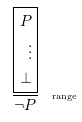

# Xcuuuse
Proof checker

how to build: `ghc --make -shared -fPIC Xcuuuse.hs -o xcuuus.so`

## List of rules

List of rules supported by Xcuuuse. The number and types (single line or range of box) are listed. The order of references does not matter, as long as they are of the correct type.

**Conjuntion introduction**  
  
**Conjunction elimination**  
  
**Double negation introduction**  
  
**Double negation elimination**  
  
**Implication introduction**  
  
**Implication elimination (modus ponens)**  
  
**Modus tollens**  
  
**Disjunction introduction**  
  
**Disjunction elimination**  
  
**Reiterate**  
  
**Contradiction elimination**  
  
**Negation introduction**  
  
**Negation elimination**  
  
**Proof by contradiction (reductio ad absurdum)**  
  
**Law of excluded middle (tertium non datur)**  
  

## Grammar

*Proof* ::= (*Premise*)\* *Conclusion* (*Derivation*)\+  
*Premise* ::= *Natural* *Formula* p  
*Conclusion* ::= *Thensym* *Formula*  
*Derivation* ::= *Natural* *Scope* *Formula* *Justification*  
*Scope* ::= ('|')\* ('\*')?
*Justification* ::= *Symbol* *RuleType* *Reference*  
*Reference* ::= *Natural* | *Range* | *Natural* , *Reference* | *Range* , *Reference*  
*Formula* ::= *Variable* | ( *Formula* ) | *Negation* | *Conjunction* | *Disjunction* | *Implication* | *Equivalence* | *Contradiction*  
*Variable* ::= *Uppercase* | *Variable* *Num* | *Variable* '  
*Negation* ::= *Negsym* *Formula*  
*Conjunction* ::= *Formula* *Consym* *Formula*  
*Disjunction* ::= *Formula* *Dissym* *Formula*  
*Implication* ::= *Formula* *Impsym* *Formula*  
*Equivalence* ::= *Formula* *Eqsym* *Formula*  
*Contradiction* ::= #  
*Symbol* := *Negsym* | *Consym* | *Dissym* | *Impsym* | *Eqsym*  

*Num* ::= 0|...|9  
*Natural* ::= 1|...|9 | *Natural* *Num*  
*Range* ::= *Natural* - *Natural*  
*Uppercase* ::= A|...|Z  
*Negsym* ::= - | ~  
*Consym* ::= & | /\  
*Dissym* ::= v | \\/  
*Impsym* ::= -> | =>  
*Eqsym* ::= = | <=>  
*Thensym* ::= '|-'  
*RuleType* ::= i | e
